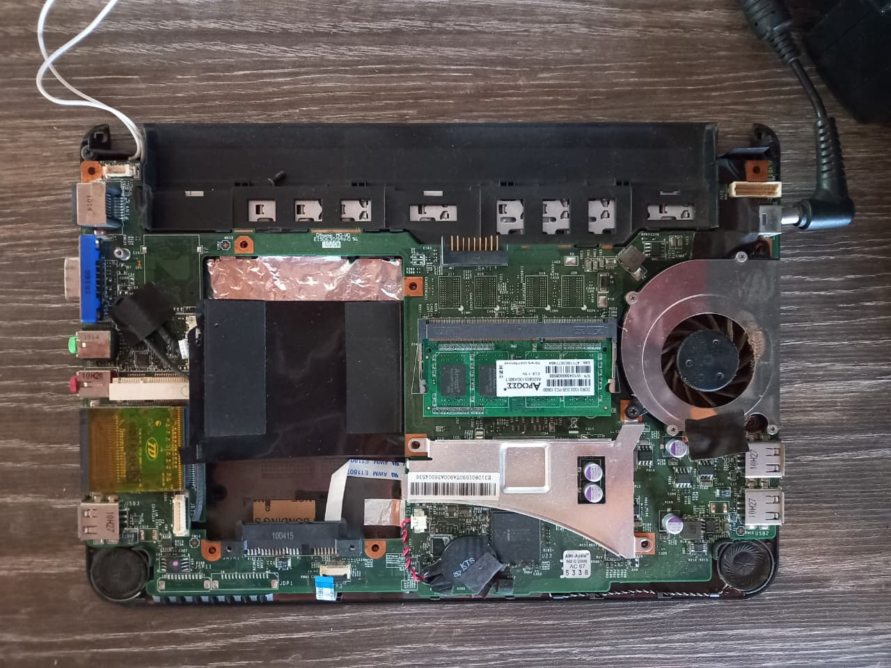
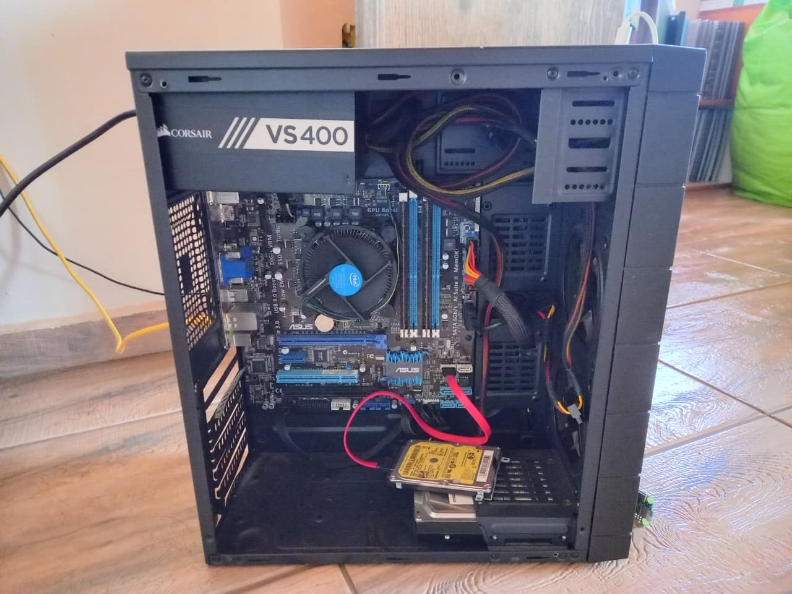
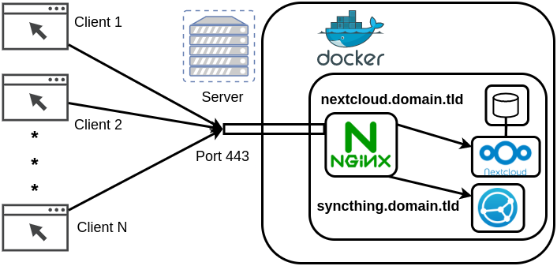
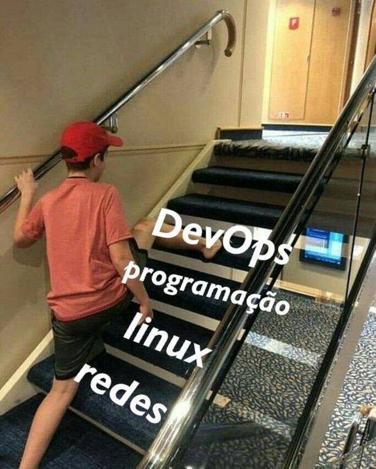

# Homelab e Self-Hosting: Monte seu servidor, ganhe privacidade e aprenda se divertindo

Gabriel Monteiro de Souza

[Semana de SI](https://semanadesi.com/)

20 de agosto de 2025

---

## $ whoami

Estudante do 6º semestre de SI

Meus links: [gabrielsouza.top/about](https://gabrielsouza.top/about)

---

## O que signfica self-host/homelab

**Self-host** é a atividade de você gerenciar por conta própria um serviço e seus dados, podendo partir do Hardware ou do SO diretamente.

**Homelab** é o ato de fazer o __self-host__ em casa, utilizando um equipamento de servidor ou computadores reciclados.

---

## Porque fazer self-hosting?

Temos **2** principais problemáticas:

* Lixo eletrônico
* Dependência de Big Techs

---

## Lixo eletrônico

Os computadores eventualmente ficam lentos e acabamos deixando de canto, e até descartando, por que não darmos uma nova utilidade a eles?!

---

## Dependência de Big Techs

Muitos serviços que utilizamos no dia a dia dependem de grandes servidores estarem funcionando, para nós terceirizarmos onde serão guardados nossos dados a troca de uma vendida facilidade.

Junto disso, após 2013, com o vazamento de [Edward Snowden](https://pt.wikipedia.org/wiki/Edward_Snowden), a necessidade de proteger nossos dados aumentou, Fazer self-host torna isso realidade e, de quebra, é uma ótima oportunidade para aprender mais sobre Linux, Redes e Infraestrutura 😀.

<!-- vem surgindo a necessidade de proteger os dados pessoais, e podendo ter o controle de serviços necessários por conta própria é uma ótima maneira de mitigar esse problema 😀. Além disso, é uma ótima oportunidade para aprender mais de Linux e como funciona a parte de infra/DevOps. -->

---

## Outra consequência boa

Com um espaço para __hospedar__ serviços, vem junto um ambiente Linux disponível para outros usos como:

- estudar
- testar
- ambiente de desenvolvimento
- hospedar sites/bots...

---

## Onde vai ficar?

Ter os serviços em casa torna mais simples gerenciar e solucionar possíveis problemas.

Há também a possibilidade de usar em nuvem, assim, não precisa ter um computador ligado em casa.

---

## Por onde começar...

1º precisamos do __Hardware__ para rodar tudo, que pode ser:

- mini-pc
- Raspberry Pi
- Notebook antigo
- Tablet/TV Box/Celular antigo
- NAS
- Baterias, HDDs, Tomada inteligente...

---

## Meu Homelab atual

<!-- inclui a imagem do desktop -->

---

## Tenho um computador!, E agora?

Precisamos de um SO, geralmente usa-se um GNU/Linux, algumas distros boas para o servidor:

- Ubuntu Server / Debian
- Fedora Server / RHEL
- Alma Linux / Rocky Linux
- Truenas Scale / Openmediavault
- Umbrel OS
- Casa OS...

---

## O que é possível hospedar?

- [Nextcloud](https://nextcloud.com/): Um "suite Google" seu, inclui arquivos, agenda, email...
- [Homeassistant](https://www.home-assistant.io/): Automações residenciais poderoso, consegue integrar praticamente qualquer dispositivo IoT
- [Vaultwarden](https://github.com/dani-garcia/vaultwarden): Gerenciador de senhas Bitwarden
- [Jellyfin](https://jellyfin.org/)/[Plex](https://www.plex.tv/): Servidor de mídia, um "Netflix" seu
- [Pi-Hole](https://pi-hole.net/)/[AdGuard Home](https://adguard.com/en/adguard-home/overview.html): Bloqueador (de propagandas) a nível rede
- [Immich](https://immich.app/): Galeria de fotos, muito parecido com "Google photos"
- [Wireguard](https://www.wireguard.com/)/[Tailscale](https://tailscale.com/): Sua própria VPN
[awesome-selfhosted](https://github.com/awesome-selfhosted/awesome-selfhosted): Lista completa de apps self-hosted.

---

## Nem tudo é tão simples...

- Como acessar os serviços fora de casa?
- Como manter tudo seguro?
- Como garantir que não vou perder os dados?
- Como vou fazer os outros ao meu redor usar meus serviços?

---

## Como acessar os serviços fora de casa?

Se sua internet não for da Vivo, é quase certeza de que você está em um CGNAT (Carrier Grade NAT) e não é possível acessar fora de casa.

Suas alternativas são:

- Pedir um IP dinâmico fora do CGNAT (difícil)
- Usar somente IPv6 (Recomendado, porém trabalhoso e menos informação)
- Usar um "Proxy" como ponte

---

## Caso não tenha CGNAT

Na [Vivo](https://forum.adrenaline.com.br/threads/banda-larga-vivo-xdsl-fibra-optica.594503/) (Telefônica) há muitos IPv4s, possívelmente é um IP dinâmico público.

- Configurar o server com IP Fixo na rede local
- Ter um DNS dinâmico: duckdns ou freedns
- Criar as entradas de __Port Forward__ no roteador
- (opcional) Configurar o Wireguard como VPN

---

## Como fazer/usar um Proxy

- Usar o proxy reverso da [Cloudflare (Tunnel)](https://developers.cloudflare.com/cloudflare-one/connections/connect-networks/)
- Usar serviços como o [ngrok](https://ngrok.com/)
- Usar uma VPS com tunnel SSH ou VPN site-to-site (Wireguard) (+difícil)
- Usar serviços como o [Tailscale](https://tailscale.com/) ou [ZeroTier](https://www.zerotier.com/)

---

## Como acessar com segurança?

Usando boas práticas de segurança

- Use senhas fortes e únicas (use um gerenciador de senhas)
- Use um Firewall como o UFW e só libere portas dos apps usados
- Sempre mantenha tudo atualizado
- Use comandos/imagens Docker de fontes confiáveis
- Use VPN para serviços mais sensíveis

---

## Backups!

Para evitar perder os dados, sempre mantenha backup deles.

Recomendo a [estratégia 3-2-1](https://www.backblaze.com/blog/the-3-2-1-backup-strategy/): **3** cópias dos dados, **2** mídias diferentes, **1** cópia em lugar remoto.

Pode hospedar um serviço de backups automáticos também!

---

## Como fazer os outros usarem os meus serviços?

Instale a VPN nos dispositivos deles e assim configure os apps de serviços como o Immich para sincronizar as fotos, o Bitwarden para usar o seu, o Homeassistant para controlar a casa.

Comprar um domínio para acessar mais fácil, como por exemplo:
- [https://home.homelab.gabrielsouza.top](https://home.homelab.gabrielsouza.top)
- [https://pihole.homelab.gabrielsouza.top](https://pihole.homelab.gabrielsouza.top)

---

## Para fazer isso: Proxy reverso

Para usar o domínio para vários serviços, é necessário usar um proxy reverso:

---

## Depois do aprendizado, como fica?

Fonte: [morpheus_jean](https://www.reddit.com/r/selfhosted/comments/1gjc70b/selfhosting_my_blog_on_a_10_year_old_raspberry_pi/)

---

## Como começar os estudos?

Fonte: [Mateus Müller](https://www.instagram.com/p/CBO9GXyHGjL/)

---

## Referencias para aprender

- [r/homelab](https://www.reddit.com/r/homelab/) e [r/selfhosted](https://www.reddit.com/r/selfhosted/): Subreddits com opiniões e comparativos
- [Christian Lempa](https://www.youtube.com/@christianlempa) e [Wolfgang](https://www.youtube.com/@WolfgangsChannel): Canais focados em homelab e self-hosted
- [Techno Tim](https://www.youtube.com/@TechnoTim) e [NetworkChuck](https://www.youtube.com/@NetworkChuck) canais sobre redes, Linux e DevOps
- [noted.lol](https://noted.lol/) Excelente Blog sobre self-hosting com dicas e tutoriais
- [GuiaFoca Linux](https://guiafoca.org/): Apostilas completas sobre Linux e security (pt-br)
- [Fábio Akita](https://akitaonrails.com/): Um cara com ideias boas para LLM e ambiente dev

---

### Obrigado!!
### Perguntas?

Meus links:
[https://gabrielsouza.top/links](https://gabrielsouza.top/links)

